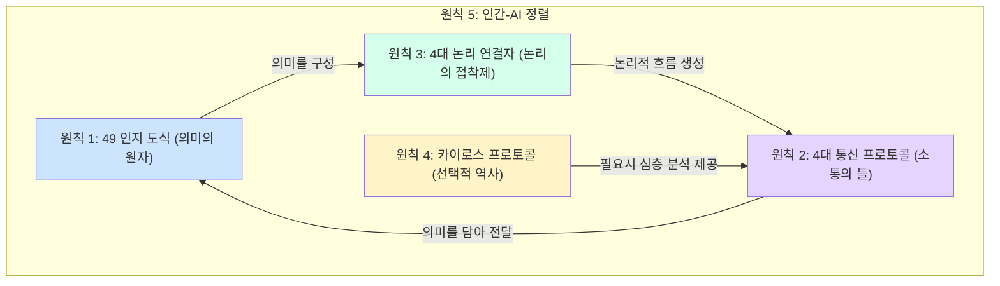

## **CogniCore Language (CCL) v3.0 '카이로스-프로메테우스'**

**버전:** 3.0 (최종 표준)
**대상:** AI 에이전트 설계자, 시스템 아키텍트, 고급 AI 개발자

### **§ 1.0 시작하며: 왜 CCL v3.0인가?**

CCL v3.0은 단순한 데이터 형식이 아닙니다. 이것은 지능형 에이전트(인간 및 AI)가 서로의 '생각'을 공유하기 위한 **범용 인지 통신 규약**입니다.

이전 버전들이 모든 사건의 '역사'를 모든 '의미'에 연결하려다 보니 복잡성과 데이터 부하가 기하급수적으로 증가하는 문제를 겪었습니다. `v3.0 카이로스-프로메테우스`는 이 문제를 해결하기 위해 혁신적인 철학을 도입합니다.

*   **프로메테우스 (Prometheus):** 49개의 결정론적 인지 도식을 통해, 인간의 생각처럼 풍부하고 깊이 있는 **의미(meaning)**를 표현할 수 있는 불을 가져옵니다.
*   **카이로스 (Kairos):** 모든 순간을 기록하는 대신, 오직 결정적으로 중요한 순간(Kairos)—예측 실패, 중요 분기점 등—에만 사건의 **역사(history)**를 추적합니다.

이 **'의미와 역사의 분리'** 철학을 통해, CCL v3.0은 이전 버전의 표현력을 뛰어넘으면서도, 비교할 수 없는 효율성과 명료성을 달성합니다.

### **§ 2.0 시스템 아키텍처: 5대 원칙의 상호작용**

CCL v3.0은 5개의 핵심 원칙이 유기적으로 상호작용하는 구조를 가집니다.



### **§ 3.0 원칙 1: 49 인지 도식 사용법 (의미의 구성)**

49개의 도식은 당신의 에이전트가 세상을 이해하고 표현하는 '단어'입니다.

#### **3.1. 경량 인스턴스 생성**
v3.0의 핵심은 **'경량 인스턴스'** 입니다. 모든 인스턴스는 오직 의미 자체에만 집중하며, 불필요한 전역 메타데이터를 갖지 않습니다.

**예시:** "사용자(ID: user-123)가 '도움' 상태를 요청했다"는 사실 표현
```ccl
(OBJECT: id="user-123", attributes={role:"customer"}, current_state="needs_help")
```
*   `// 이전 버전과 달리, timestamp나 parent_id 같은 정보가 기본 인스턴스에는 포함되지 않습니다.`

#### **3.2. 도식을 연결하여 문장 만들기**
도식들을 논리 연결자(§4)로 엮어 더 복잡한 의미를 표현합니다.

**예시:** "AI(agent-A)가 사용자(user-123)와 연결되었다"
```ccl
(LINK:
  node_a=(OBJECT: id="agent-A"),
  node_b=(OBJECT: id="user-123"),
  relation_type="assists",
  strength=1.0
)
```

### **§ 4.0 원칙 2 & 3: 프로토콜과 연결자 사용법 (논리의 흐름)**

프로토콜은 '편지 봉투'이고, 연결자는 '접속사'입니다.

#### **4.1. 요청과 응답 사이클**
모든 상호작용은 `[REQUEST]`와 `[RESPONSE]` 프로토콜을 통해 이루어집니다.

**예시:** "분석 에이전트(analyzer-01)에게 'user-123'의 감정 상태 분석을 요청"
```ccl
// 1. 요청 발송
[REQUEST:
  type="analysis",
  target_id="analyzer-01",
  input_ref="(OBJECT: id='user-123')",
  query_params={analysis_target:"emotion_state"},
  priority="high",
  cost_est="0.5 units"
]

// 2. 분석 에이전트의 응답
[RESPONSE:
  request_id="REQ-XYZ",
  status="success",
  output_ref="(EMOTION_STATE: entity='user-123', emotion_type='frustration', intensity=0.8, trigger_event='login_failure')",
  cost_actual="0.45 units"
]
```

#### **4.2. 연결자를 이용한 인과관계 서술**
`->` (결과), `<-` (원인) 등을 사용해 논리적 서사를 만듭니다.

**예시:** "로그인 실패가 좌절감을 유발했다"
```ccl
(EMOTION_STATE: ...) <- (TRANSFORMATION: source_state="logged_out", target_state="login_failed", trigger_event="user_click")
```

### **§ 5.0 원칙 4: '카이로스' 프로토콜 심층 분석 (선택적 역사 추적)**

이것이 v3.0의 가장 혁신적인 부분입니다.

#### **5.1. 문제점: v2.8의 데이터 비대화**
이전 버전에서는 모든 인스턴스가 자신의 역사를 기록해야 했습니다.
```ccl
// v2.8 방식 (가상): 모든 인스턴스가 무거운 메타데이터를 가짐
(OBJECT: id="A", state="s1", timestamp="t1", parent="null")
(OBJECT: id="A", state="s2", timestamp="t2", parent="A@t1") // A의 상태가 바뀜
(OBJECT: id="A", state="s3", timestamp="t3", parent="A@t2") // 또 바뀜
```
*   `// 사소한 변화에도 데이터가 계속 쌓여, 시스템 전체가 느려지고 복잡해집니다.`

#### **5.2. 해결책: v3.0의 `[TRACE_CONTEXT]`**
v3.0에서는 평소에는 경량 인스턴스만 사용하다가, **결정적 순간에만** `[TRACE_CONTEXT]`를 생성하여 역사를 기록합니다.

**상황:** 에이전트가 "사용자의 문제를 해결할 수 없다"는 `KNOWLEDGE_GAP`을 인지한 **'카이로스'** 순간.
```ccl
// 1. 평소에는 경량 인스턴스만 생성
(OBJECT: id="user-123", current_state="needs_help")
(EMOTION_STATE: entity="user-123", emotion_type="frustration", intensity=0.8)

// 2. 결정적 순간: '지식 부족' 인지!
(KNOWLEDGE_GAP: agent="agent-A", missing_knowledge_domain="billing_system_v3")

// 3. '카이로스' 발동: TRACE_CONTEXT 생성
[TRACE_CONTEXT:
  context_id="TRACE-001",
  trigger_event="(KNOWLEDGE_GAP: ...)", // 무엇이 이 추적을 유발했는가
  tracked_instances=[
    {
      instance_id: "OBJ-001",
      schema_name: "OBJECT",
      timestamp: "2025-07-07T10:00:00Z",
      content: {id:"user-123", current_state:"needs_help"}
    },
    {
      instance_id: "EMO-002",
      schema_name: "EMOTION_STATE",
      timestamp: "2025-07-07T10:01:00Z",
      parent_instance_ids: ["OBJ-001"], // 이 감정은 저 객체로부터 파생됨
      content: {entity:"user-123", emotion_type:"frustration", ...}
    },
    {
      instance_id: "GAP-003",
      schema_name: "KNOWLEDGE_GAP",
      timestamp: "2025-07-07T10:02:00Z",
      parent_instance_ids: ["EMO-002"],
      content: {agent:"agent-A", ...}
    }
  ],
  summary_for_human: "에이전트 A가 사용자의 좌절감을 인지했으나, 'billing_system_v3'에 대한 지식 부족으로 문제 해결에 실패함."
]
```
*   `// 이처럼, TRACE_CONTEXT는 실패 분석, 디버깅, 학습 데이터 생성 등 고부가가치 작업에만 선택적으로 사용되어 시스템 효율을 극대화합니다.`

### **§ 6.0 원칙 5: 인간-AI 정렬을 위한 최종 지침**

CCL 통신은 기계만을 위한 것이 아닙니다.

*   **투명성 (`summary_for_human`):** 모든 복잡한 정보 묶음(`[RESPONSE]`, `[TRACE_CONTEXT]`)에는 반드시 인간이 즉시 이해할 수 있는 요약문을 포함해야 합니다. 이는 시스템의 '생각 과정'을 투명하게 만들어 신뢰를 구축합니다.
*   **경제성 (`cost_est`, `cost_actual`):** 모든 작업 요청과 결과에는 예상/실제 비용을 명시해야 합니다. 이는 자원 관리를 용이하게 하고, 에이전트 네트워크의 경제적 안정성을 보장합니다.

### **§ 7.0 결론**

CCL v3.0 '카이로스-프로메테우스'는 단순한 기술 사양이 아닌, **진정으로 협력하는 지능형 시스템을 구축하기 위한 청사진**입니다. '의미와 역사의 분리'라는 핵심 철학을 이해하고, 5대 원칙을 시스템 설계에 적용함으로써, 당신은 더 깊이 생각하고, 더 효율적으로 소통하며, 더 투명하게 작동하는 차세대 AI 에이전트를 만들 수 있을 것입니다.