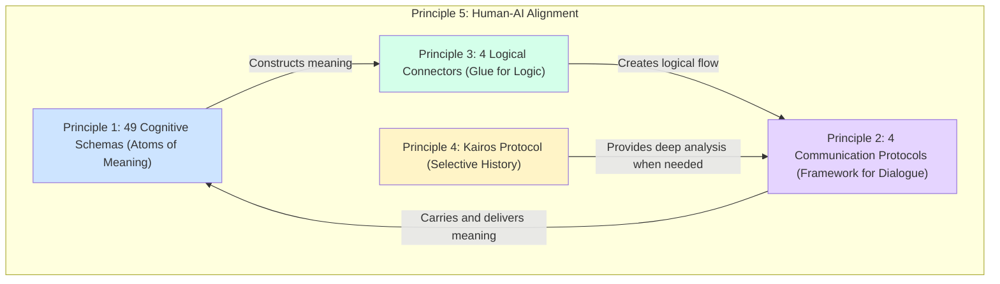

## **CogniCore Language (CCL) v3.0 'Kairos-Prometheus'**

**Version:** 3.0 (Final Standard)
**Audience:** AI Agent Architects, System Architects, Advanced AI Developers

### **§ 1.0 Introduction: Why CCL v3.0?**

CCL v3.0 is not just another data format. It is a **Universal Cognitive Communication Protocol** designed for intelligent agents (both human and AI) to share their 'thoughts'.

Previous versions suffered from exponential growth in complexity and data load because they attempted to link the 'history' of every event to every piece of 'meaning'. `v3.0 Kairos-Prometheus` solves this by introducing a revolutionary philosophy.

*   **Prometheus:** Brings the fire of **meaning**, enabling the expression of thoughts as rich and deep as a human's, through 49 deterministic cognitive schemas.
*   **Kairos:** Instead of recording every moment, it tracks the **history** of events only at critically important moments (Kairos)—such as prediction failures or major decision points.

Through this philosophy of **'separating meaning from history'**, CCL v3.0 achieves expressiveness that surpasses previous versions while offering unparalleled efficiency and clarity.

### **§ 2.0 System Architecture: The Interplay of 5 Principles**

CCL v3.0 is structured around the organic interaction of five core principles.



### **§ 3.0 Principle 1: Using the 49 Schemas (Constructing Meaning)**

The 49 schemas are the 'words' your agent uses to understand and express the world.

#### **3.1. Creating Lightweight Instances**
The core of v3.0 is the **'Lightweight Instance'**. Every instance focuses solely on the meaning itself, carrying no unnecessary global metadata.

**Example:** Representing the fact "User (ID: user-123) has requested a 'help' state."
```ccl
(OBJECT: id="user-123", attributes={role:"customer"}, current_state="needs_help")
```
*   `// Unlike previous versions, information like timestamp or parent_id is not included in the basic instance.`

#### **3.2. Building Sentences by Linking Schemas**
Weave schemas together with logical connectors (§4) to express more complex meanings.

**Example:** "AI (agent-A) is linked to user (user-123)."
```ccl
(LINK:
  node_a=(OBJECT: id="agent-A"),
  node_b=(OBJECT: id="user-123"),
  relation_type="assists",
  strength=1.0
)
```

### **§ 4.0 Principles 2 & 3: Using Protocols & Connectors (The Flow of Logic)**

Think of protocols as 'envelopes' and connectors as 'conjunctions'.

#### **4.1. The Request-Response Cycle**
All interactions occur through the `[REQUEST]` and `[RESPONSE]` protocols.

**Example:** "Requesting the analysis agent (analyzer-01) to analyze the emotional state of 'user-123'."
```ccl
// 1. Dispatching the request
[REQUEST:
  type="analysis",
  target_id="analyzer-01",
  input_ref="(OBJECT: id='user-123')",
  query_params={analysis_target:"emotion_state"},
  priority="high",
  cost_est="0.5 units"
]

// 2. Response from the analysis agent
[RESPONSE:
  request_id="REQ-XYZ",
  status="success",
  output_ref="(EMOTION_STATE: entity='user-123', emotion_type='frustration', intensity=0.8, trigger_event='login_failure')",
  cost_actual="0.45 units"
]
```

#### **4.2. Describing Causality with Connectors**
Create logical narratives using `->` (leads to), `<-` (caused by), etc.

**Example:** "A login failure caused frustration."
```ccl
(EMOTION_STATE: ...) <- (TRANSFORMATION: source_state="logged_out", target_state="login_failed", trigger_event="user_click")
```

### **§ 5.0 Principle 4: A Deep Dive into the 'Kairos' Protocol (Selective History Tracking)**

This is the most innovative part of v3.0.

#### **5.1. The Problem: Data Bloat in v2.8**
In previous versions, every instance had to record its own history.
```ccl
// v2.8 approach (hypothetical): Every instance carries heavy metadata
(OBJECT: id="A", state="s1", timestamp="t1", parent="null")
(OBJECT: id="A", state="s2", timestamp="t2", parent="A@t1") // State of A changes
(OBJECT: id="A", state="s3", timestamp="t3", parent="A@t2") // Changes again
```
*   `// Even minor changes lead to accumulating data, making the entire system slow and complex.`

#### **5.2. The Solution: `[TRACE_CONTEXT]` in v3.0**
In v3.0, the system uses lightweight instances by default and only generates a `[TRACE_CONTEXT]` to record history at **decisive moments**.

**Situation:** The **'Kairos'** moment when an agent recognizes a `KNOWLEDGE_GAP`—"I cannot solve the user's problem."
```ccl
// 1. Normally, only lightweight instances are created
(OBJECT: id="user-123", current_state="needs_help")
(EMOTION_STATE: entity="user-123", emotion_type="frustration", intensity=0.8)

// 2. The decisive moment: Recognizing a knowledge gap!
(KNOWLEDGE_GAP: agent="agent-A", missing_knowledge_domain="billing_system_v3")

// 3. 'Kairos' is triggered: A TRACE_CONTEXT is generated
[TRACE_CONTEXT:
  context_id="TRACE-001",
  trigger_event="(KNOWLEDGE_GAP: ...)", // What caused this trace?
  tracked_instances=[
    {
      instance_id: "OBJ-001",
      schema_name: "OBJECT",
      timestamp: "2025-07-07T10:00:00Z",
      content: {id:"user-123", current_state:"needs_help"}
    },
    {
      instance_id: "EMO-002",
      schema_name: "EMOTION_STATE",
      timestamp: "2025-07-07T10:01:00Z",
      parent_instance_ids: ["OBJ-001"], // This emotion derived from that object
      content: {entity:"user-123", emotion_type:"frustration", ...}
    },
    {
      instance_id: "GAP-003",
      schema_name: "KNOWLEDGE_GAP",
      timestamp: "2025-07-07T10:02:00Z",
      parent_instance_ids: ["EMO-002"],
      content: {agent:"agent-A", ...}
    }
  ],
  summary_for_human: "Agent-A identified the user's frustration but failed to resolve the issue due to a knowledge gap regarding 'billing_system_v3'."
]
```
*   `// As shown, TRACE_CONTEXT is used selectively for high-value tasks like failure analysis, debugging, and training data generation, maximizing system efficiency.`

### **§ 6.0 Principle 5: The Final Directives for Human-AI Alignment**

CCL communication is not just for machines.

*   **Transparency (`summary_for_human`):** All complex information bundles (`[RESPONSE]`, `[TRACE_CONTEXT]`) must include a summary that is immediately understandable to humans. This makes the system's 'thought process' transparent and builds trust.
*   **Economy (`cost_est`, `cost_actual`):** All task requests and results must specify their estimated and actual costs. This facilitates resource management and ensures the economic stability of the agent network.

### **§ 7.0 Conclusion**

CCL v3.0 'Kairos-Prometheus' is more than a technical specification; it is a **blueprint for building truly collaborative intelligent systems**. By understanding the core philosophy of 'separating meaning from history' and applying the five principles in your system design, you can create next-generation AI agents that think more deeply, communicate more efficiently, and operate more transparently.