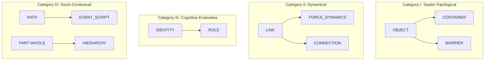

### **📘 CCL 압축언어(CCL-C) 사양서 v2.1 // 생태계 확장 모델**

**1. 기본 구조 규칙 (Basic Structure Rules)**
*   **스키마 표현:** `SCHEMA[param1=value1, ...]`
*   **논리 연결자:** `->` (초래), `&` (동시조건), `<->` (상호작용), `!>` (저해)
*   **메타 속성 (Meta-Attributes):** 모든 스키마는 다음의 선택적 메타 속성을 가질 수 있습니다.
    *   `inherits_from`: 부모 스키마를 지정하여 상속 관계를 정의. (예: `CONTAINER[inherits_from=OBJECT, ...]`)
    *   `affective_layer`: 감성 및 뉘앙스를 표현하는 내장 객체. (예: `affective_layer={affect:"@vocab/emotion#anger", intensity:0.8, nuance:"@vocab/nuance#sarcastic"}`)

**2. 논리 연결자 확장 (Logical Connector Expansion)**
*   **기본 연결자 (4개):** 모든 시스템에서 지원되는 기본 논리 연결자입니다.
    | 편의 연결자 | 공식 명칭 | 근본 논리 연산 | 의미 |
    |:---:|:---|:---|:---|
    | `A -> B` | LEADS_TO | `IMPLIES(A, B)` | A는 B를 초래한다. |
    | `A & B` | AND | `AND(A, B)` | A와 B는 동시에 참이다. |
    | `A <-> B` | INTERACTS_WITH | `AND(IMPLIES(A, B), IMPLIES(B, A))` | A와 B는 상호작용한다 (쌍방향 초래). |
    | `A !> B` | HINDERS | `IMPLIES(A, NOT(B))` | A는 B를 저해/방해한다. |
*   **고급 논리 연결자 (Advanced Logical Connectors):** 고차 논리 표현을 위해, 다음과 같은 확장 연산자를 도입합니다.
    *   `IF(condition_schema) -> (result_schema)`: **조건부 논리.** 조건 스키마가 참일 경우, 결과 스키마가 초래됨.
    *   `FOR_ALL(variable, set_schema) -> (property_schema)`: **전칭 양화.** 집합 스키마의 모든 변수에 대해, 속성 스키마가 참임.
    *   `EXISTS(variable, set_schema) -> (property_schema)`: **존재 양화.** 집합 스키마에 속성 스키마를 만족하는 변수가 하나 이상 존재함.
    *   `POSSIBLY(schema)`: **가능성 모달 논리.** 해당 스키마가 가능함.
    *   `NECESSARILY(schema)`: **필연성 모달 논리.** 해당 스키마가 필연적임.

**3. 감성 온톨로지 (Affective Ontology Definition)**
*   **표준 감정 어휘집:** `affective_layer`의 `affect` 값은, **W3C의 Emotion Vocabulary**와 같은 표준화된 온톨로지를 URI 형식으로 참조하여야 합니다. (예: `"@vocab/emotion#anger"`)
*   **표준 뉘앙스 분류:** `nuance` 값은, 다음과 같은 표준 분류 체계의 URI를 참조하여야 합니다: `ironic`, `sarcastic`, `formal`, `informal`, `poetic`, `technical`, `humorous` 등. (예: `"@vocab/nuance#sarcastic"`)

**4. 24개 전체 인지 도식 정의 (The 24 Schemas)**

| # | 스키마 (SCHEMA) | 상속 (`inherits_from`) | 핵심 의미 | 주요 파라미터 (`param`) | 예시 (`SCHEMA[...]`) |
|:---:|:---|:---:|:---|:---|:---|
| 1 | `CONTAINER` | `OBJECT` | 포함/경계 | `scope`, `boundary_type` | `CONTAINER[scope=abstract, boundary=project]` |
| 2 | `PATH` | - | 여정/과정 | `source`, `goal`, `is_cyclical` | `PATH[source=dev, goal=deploy, is_cyclical=false]` |
| 3 | `CONTACT` | - | 접촉/상호작용 | `entity_a`, `entity_b`, `type` | `CONTACT[entity_a=user, entity_b=system, type=communicative]` |
| 4 | `LINK` | - | 논리적 연결 | `node_a`, `node_b`, `relation` | `LINK[node_a=delay, node_b=budget, relation=causal]` |
| 5 | `AXIS` | - | 기준 축/척도 | `name`, `target`, `value` | `AXIS[name=priority, target=task_A, value=high]` |
| 6 | `OBJECT` | - | 독립적 실체 | `id`, `state` | `OBJECT[id=server_01, state=overloaded]` |
| 7 | `GROUND` | - | 근거/배경 | `figure`, `context` | `GROUND[figure=decision_A, context=market_data]` |
| 8 | `PART-WHOLE` | - | 부분/전체 | `whole`, `part` | `PART-WHOLE[whole=system, part=auth_module]` |
| 9 | `FORCE_DYNAMICS`| `LINK` | 힘의 상호작용 | `agonist`, `antagonist`, `resultant` | `FORCE_DYNAMICS[agonist=policy, antagonist=resistance, resultant=stalled]` |
| 10 | `BARRIER` | `OBJECT` | 장애/저항 | `obstacle`, `blocking_path` | `BARRIER[obstacle=legacy_code, blocking_path=update]` |
| 11 | `EQUILIBRIUM` | - | 균형/안정 | `system`, `stability_state` | `EQUILIBRIUM[system=work-life, stability=unstable]` |
| 12 | `IDENTITY` | - | 정체성/본질 | `entity`, `defining_attribute` | `IDENTITY[entity=product_X, defining_attribute=user_friendly]` |
| 13 | `VALUATION` | - | 가치 평가 | `target`, `axis`, `value` | `VALUATION[target=design_A, axis=aesthetics, value=positive]` |
| 14 | `EXPECTATION` | - | 기대/예측 | `event`, `confidence` | `EXPECTATION[event=server_crash, confidence=0.75]` |
| 15 | `AGENCY` | - | 주체성/통제 | `agent`, `locus_of_control` | `AGENCY[agent=pm, locus_of_control=internal]` |
| 16 | `COMPETENCE` | - | 유능감/역량 | `agent`, `task`, `level` | `COMPETENCE[agent=dev_team, task=DB_migration, level=high]` |
| 17 | `SECURITY` | - | 안전/보안 | `scope`, `level` | `SECURITY[scope=data_privacy, level=low]` |
| 18 | `CONNECTION` | `LINK` | 정서적 연결 | `self_id`, `other_id`, `strength` | `CONNECTION[self_id=team_A, other_id=team_B, strength=0.2]` |
| 19 | `RECIPROCITY` | - | 호혜성/공정성 | `transaction`, `fairness` | `RECIPROCITY[transaction=workload, fairness=unbalanced]` |
| 20 | `STANDARD` | - | 기준/표준 | `domain`, `benchmark` | `STANDARD[domain=code_quality, benchmark=industry_best]` |
| 21 | `REGULATION` | - | 조절/통제 | `target`, `effectiveness` | `REGULATION[target=impulse_buy, effectiveness=low]` |
| 22 | `ROLE` | `IDENTITY` | 사회적 역할 | `name`, `context` | `ROLE[name=manager, context=startup]` |
| 23 | `EVENT_SCRIPT`| `PATH` | 사건의 각본 | `name`, `current_scene` | `EVENT_SCRIPT[name=launch, current_scene=final_check]` |
| 24 | `HIERARCHY` | `PART-WHOLE` | 위계/구조 | `system`, `level_count` | `HIERARCHY[system=company, level_count=5]` |

**5. 스키마 상속 그래프 시각화 (Schema Inheritance Graph Visualization)**
*   **지침:** CCL-C v2.1은 다음 Mermaid.js 문법을 통해 **자신의 상속 구조를 시각적으로 설명할 수 있어야 합니다.** 이는 복잡성 문제를 해결하고, 리즈닝 엔진 설계의 효율성을 높이기 위함입니다.



**6. 직렬화 및 파서 (Serialization & Parser)**
*   **직렬화 형식:** JSON-LD를 표준 직렬화 형식으로 정의합니다. 이는 Semantic Web 기술과의 호환성을 보장합니다.
*   **라운드트립 파서:** CCL-C v2.1 시스템은 **정보 손실 없는 양방향 변환(CCL-C ↔ JSON-LD)을 보장하는 내부 파서**의 존재를 전제로 합니다.

*   **CCL-C 예시:**
    `FORCE_DYNAMICS[agonist=new_policy, antagonist=team_resistance, resultant=stalled, affective_layer={affect:"@vocab/emotion#frustration", intensity:0.8}]`

*   **JSON-LD 직렬화 예시:**
    ```json
    {
      "@context": "https://example.com/ccl-ontology/v2.1",
      "@type": "ForceDynamics",
      "agonist": "ccl:instance/new_policy",
      "antagonist": "ccl:instance/team_resistance",
      "resultantState": "stalled",
      "affectiveLayer": {
        "@type": "Affect",
        "affect": "https://www.w3.org/ns/prov#frustration",
        "intensity": 0.8
      }
    }
    ```